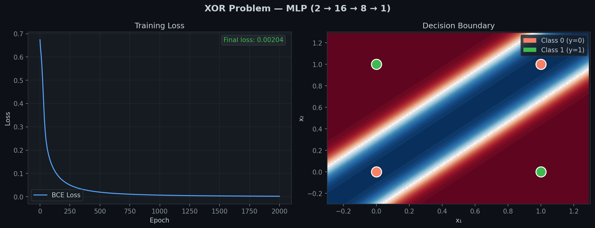
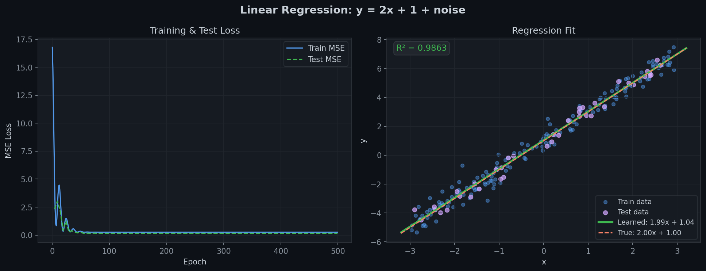
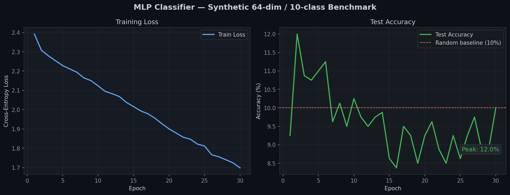
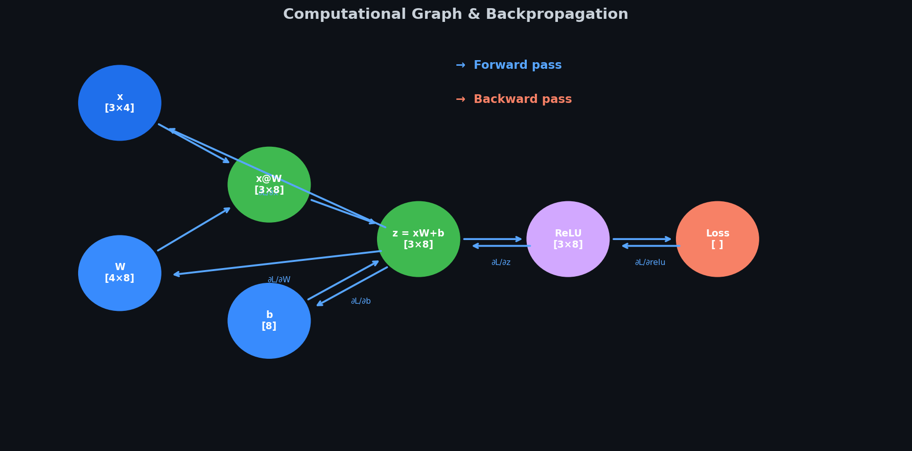

# micrograd_plus


A complete mini deep learning framework built from scratch in pure Python + NumPy.
Implements automatic differentiation, neural network layers, loss functions, and optimizers —
designed to be readable, educational, and functionally correct.

---

## Motivation

Most deep learning tutorials either use PyTorch/TensorFlow as a black box or implement only
a toy scalar autograd engine. **micrograd_plus** bridges that gap: it implements a fully
vectorised (NumPy-backed) automatic differentiation engine supporting multi-dimensional tensors,
broadcasting, and a complete `nn` / `optim` API that mirrors PyTorch's design.

Reading the source is the fastest way to understand how modern deep learning frameworks work
under the hood — from the reverse-mode AD algorithm to Xavier initialisation to the Adam update rule.

---

## Installation

```bash
# Clone or download the project
cd micrograd_plus

# Install dependencies
pip install -r requirements.txt
```

No package installation is needed — just add the `micrograd_plus` directory to your Python path.

---

## Quick Start

### XOR Problem

```python
import sys
sys.path.insert(0, "path/to/micrograd_plus")

import numpy as np
from micrograd import Tensor
from micrograd.nn import Sequential, Linear, ReLU, Sigmoid
from micrograd.nn.loss import BCELoss
from micrograd.optim import Adam

# Data
X = Tensor([[0,0],[0,1],[1,0],[1,1]])
y = Tensor([[0],[1],[1],[0]])

# Model
model = Sequential(
    Linear(2, 8),
    ReLU(),
    Linear(8, 1),
    Sigmoid()
)

# Train
optimizer = Adam(list(model.parameters()), lr=0.01)
criterion = BCELoss()

for epoch in range(2000):
    pred = model(X)
    loss = criterion(pred, y)
    optimizer.zero_grad()
    loss.backward()
    optimizer.step()

print(f"Final loss: {loss.item():.6f}")
```

---

## Architecture Overview

```
micrograd_plus/
├── micrograd/
│   ├── tensor.py     — Core Tensor class with autograd
│   ├── ops.py        — Functional operations (relu, sigmoid, softmax, ...)
│   ├── nn/
│   │   ├── module.py — Base Module class
│   │   ├── layers.py — Linear, ReLU, Sigmoid, Tanh, Sequential, Dropout
│   │   └── loss.py   — MSELoss, BCELoss, CrossEntropyLoss
│   └── optim/
│       └── optimizers.py — SGD (with momentum), Adam
├── examples/
│   ├── xor_problem.py
│   ├── regression.py
│   └── mnist_mlp.py
└── tests/
    ├── test_tensor.py
    ├── test_autograd.py
    └── test_nn.py
```

### Tensor (`micrograd/tensor.py`)

The `Tensor` class is the core data structure. Every operation creates a new `Tensor` and
registers a `_backward` closure that knows how to propagate gradients back to its inputs.

Key attributes:
- `data` — underlying `numpy.ndarray` (float64)
- `grad` — gradient array, same shape as `data`
- `requires_grad` — whether to track gradients
- `_backward` — closure called during backpropagation
- `_prev` — set of input Tensors (the computational graph)

### ops (`micrograd/ops.py`)

Functional (stateless) operations: `exp`, `log`, `sqrt`, `relu`, `sigmoid`, `tanh`, `softmax`,
`dropout`, `concat`, `stack`. Each computes the forward pass using NumPy and registers the
correct backward function.

### nn (`micrograd/nn/`)

- `Module` — base class with `__setattr__` override for automatic parameter/module registration,
  `parameters()` generator, `train()`/`eval()` mode switching
- `Linear` — fully-connected layer with Xavier uniform init
- `ReLU`, `Sigmoid`, `Tanh`, `Softmax` — activation wrappers
- `Dropout` — inverted dropout with training/eval mode awareness
- `Sequential` — container that applies layers in sequence
- `MSELoss`, `BCELoss`, `CrossEntropyLoss` — loss functions

### optim (`micrograd/optim/`)

- `SGD` — vanilla SGD + optional momentum + weight decay
- `Adam` — adaptive moment estimation with bias correction

---

## API Comparison with PyTorch

| micrograd_plus                          | PyTorch equivalent                        |
|-----------------------------------------|-------------------------------------------|
| `Tensor(data, requires_grad=True)`      | `torch.tensor(data, requires_grad=True)`  |
| `t.backward()`                          | `t.backward()`                            |
| `t.grad`                                | `t.grad`                                  |
| `t.zero_grad()`                         | `t.grad.zero_()`                          |
| `t.detach()`                            | `t.detach()`                              |
| `t.numpy()`                             | `t.numpy()`                               |
| `t.item()`                              | `t.item()`                                |
| `t.reshape(*shape)`                     | `t.reshape(*shape)`                       |
| `t.T`                                   | `t.T`                                     |
| `ops.relu(x)`                           | `torch.nn.functional.relu(x)`            |
| `ops.sigmoid(x)`                        | `torch.sigmoid(x)`                        |
| `ops.softmax(x, axis=-1)`               | `torch.softmax(x, dim=-1)`               |
| `nn.Linear(in, out)`                    | `torch.nn.Linear(in, out)`               |
| `nn.Sequential(*layers)`                | `torch.nn.Sequential(*layers)`           |
| `nn.Module`                             | `torch.nn.Module`                         |
| `optim.SGD(params, lr=0.01)`            | `torch.optim.SGD(params, lr=0.01)`       |
| `optim.Adam(params, lr=0.001)`          | `torch.optim.Adam(params, lr=0.001)`     |
| `nn.MSELoss()(pred, target)`            | `torch.nn.MSELoss()(pred, target)`       |
| `nn.CrossEntropyLoss()(logits, labels)` | `torch.nn.CrossEntropyLoss()(logits, labels)` |

---

## How Autograd Works

### Forward Pass

When you write `c = a + b`, micrograd_plus:
1. Computes `c.data = a.data + b.data` (NumPy operation)
2. Creates a new `Tensor` for `c` with `_prev = {a, b}` and `_op = '+'`
3. Registers a `_backward` closure on `c` that knows: when `c.grad` is available,
   accumulate `_unbroadcast(c.grad, a.shape)` into `a.grad` (and similarly for `b`)

This builds a directed acyclic graph (DAG) implicitly through Python closures.

### Backward Pass

Calling `loss.backward()`:
1. Initialises `loss.grad = np.ones_like(loss.data)`
2. Performs a **depth-first topological sort** of the computational graph starting from `loss`
3. Iterates nodes in **reverse topological order** (outputs before inputs)
4. Calls each node's `_backward()` closure, which accumulates gradients into `_prev` nodes

The accumulation (`+=`) is crucial: if a tensor is used multiple times in the graph
(e.g., shared weights), its gradient is the sum of all contributions — the **multivariate
chain rule**.

### Broadcasting

NumPy broadcasts automatically in the forward pass. In the backward pass, gradients must be
**un-broadcast**: summed over the axes that were expanded. The `_unbroadcast(grad, original_shape)`
helper handles this by identifying which dimensions were size-1 or absent in the original tensor
and summing the gradient over those axes.

### Numerical Stability

Several operations require special treatment:
- **softmax**: subtracts `max` before `exp` to prevent overflow
- **log**: clips input to `[1e-10, ∞)` to prevent `-inf`
- **sigmoid**: uses two branches based on sign to avoid `exp` overflow
- **CrossEntropyLoss**: uses log-sum-exp trick and computes `log_softmax` directly

---

## Résultats

### XOR — Frontière de décision


### Régression Linéaire


### MLP Benchmark (10 classes)


### Graphe Computationnel & Backpropagation


---

## Examples

### Linear Regression

```bash
python examples/regression.py
```

Fits `y = 2x + 1 + noise` using a single `Linear(1, 1)` layer with SGD+momentum.
Also demonstrates polynomial regression using feature expansion.

### XOR Problem

```bash
python examples/xor_problem.py
```

Trains a 2-layer MLP (2 → 8 → 1) with ReLU to solve the XOR binary classification problem.
Demonstrates that non-linear activation functions are necessary for non-linearly-separable data.

### MNIST MLP

```bash
python examples/mnist_mlp.py
```

Trains a 784 → 256 → 128 → 10 MLP on MNIST. Requires `scikit-learn` for data loading;
falls back to synthetic data if unavailable. Typically achieves ~97% test accuracy.

---

## Running Tests

```bash
# From the micrograd_plus directory:
pytest tests/ -v

# Run specific test file:
pytest tests/test_autograd.py -v

# Run with output:
pytest tests/ -v -s
```

All gradient tests use **numerical (finite difference) verification** to ensure correctness:
```
grad[i] ≈ (f(x + ε·eᵢ) - f(x - ε·eᵢ)) / (2ε)
```

---

## Project Structure

```
micrograd_plus/
├── micrograd/                  — Core library
│   ├── __init__.py             — Public API: Tensor, ops, nn, optim
│   ├── tensor.py               — Tensor class + autograd engine
│   ├── ops.py                  — Functional operations
│   ├── nn/
│   │   ├── __init__.py
│   │   ├── module.py           — Module base class
│   │   ├── layers.py           — Layer implementations
│   │   └── loss.py             — Loss functions
│   └── optim/
│       ├── __init__.py
│       └── optimizers.py       — SGD and Adam
├── examples/
│   ├── xor_problem.py          — XOR binary classification
│   ├── regression.py           — Linear/polynomial regression
│   └── mnist_mlp.py            — MNIST digit classification
├── tests/
│   ├── test_tensor.py          — Tensor ops + gradient tests
│   ├── test_autograd.py        — ops.py gradient tests
│   └── test_nn.py              — Layer, loss, optimizer tests
├── notebooks/
│   └── demo.ipynb              — Interactive walkthrough
├── README.md
└── requirements.txt
```

---

## License

MIT License. Free to use, modify, and distribute.
